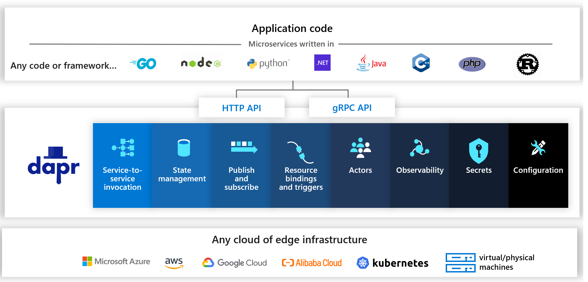
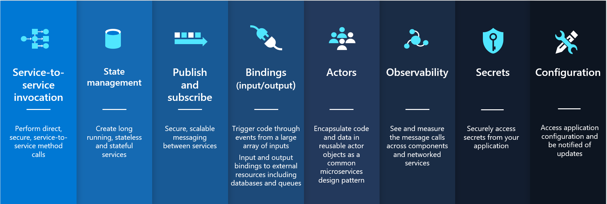
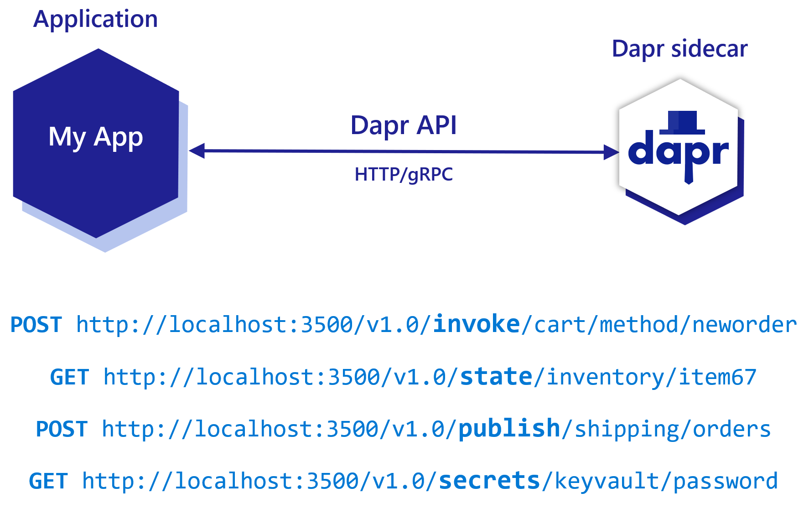
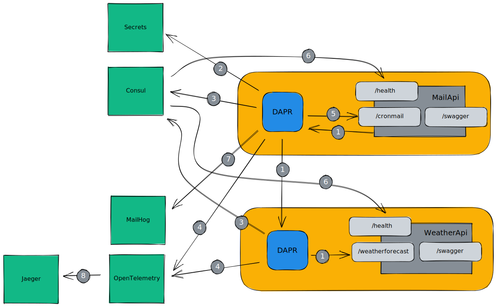
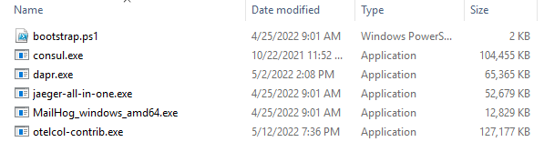

# Let's TYE it together: an introduction to building micro services using DAPR

This Dapr and Tye workshop focuses on setting up a micro-services architecture running on your local computer using Project Tye and Dapr without having the need to setup a local Kubernetes cluster and can be run without Docker. 

## Project Tye
>Tye is a developer tool that makes developing, testing, and deploying microservices and distributed applications easier. Project Tye includes a local orchestrator to make developing microservices easier and the ability to deploy microservices to Kubernetes with minimal configuration.

https://github.com/dotnet/tye

We will use Project Tye for the developing and testing part.

## Dapr
Full documentation is available at https://dapr.io/

### Overview
What is Dapr?

>Dapr is a portable, event-driven runtime that makes it easy for any developer to build resilient, stateless and stateful applications that run on the cloud and edge and embraces the diversity of languages and developer frameworks. Leveraging the benefits of a sidecar architecture, Dapr helps you tackle the challenges that come with building microservices and keeps your code platform agnostic.


https://docs.dapr.io/concepts/overview/




### Building blocks

>There are many considerations when architecting microservices applications. Dapr provides best practices for common capabilities when building microservice applications that developers can use in a standard way, and deploy to any environment. It does this by providing distributed system building blocks.

https://docs.dapr.io/concepts/building-blocks-concept/



### Sidecar pattern

>Dapr exposes its HTTP and gRPC APIs as a sidecar architecture, either as a container or as a process, not requiring the application code to include any Dapr runtime code. This makes integration with Dapr easy from other runtimes, as well as providing separation of the application logic for improved supportability



### Dapr in this workshop
In this workshop we will be using the following Dapr building blocks:

- Service Invocation
- Bindings
- Secrets Management

We will use Tye to run all components, including the Dapr sidecars, the workloads and all other supporting services.

We will create two micro services: a Mail Api and a Weather API where the first will be triggered by Dapr using a cron job and it will call the second using Dapr service invocation.

After having done all assignments, the final state of this workshop will be:



1. [Dapr Service Invocation](https://docs.dapr.io/developing-applications/building-blocks/service-invocation/)
    We will use a synchronous service invocation from the MailApi to the WeatherApi using the Service Invocation Building block
2. [Dapr Secrets Management](https://docs.dapr.io/developing-applications/building-blocks/secrets/)
    We will retrieve secrets using Secrets Management and will swap the secret store being used
3. [Dapr Consul name resolution](https://docs.dapr.io/reference/components-reference/supported-name-resolution/setup-nr-consul/)
    Dapr will register the workload service using the Consul name resolution component
4. [Dapr Distributed Tracing](https://docs.dapr.io/developing-applications/building-blocks/observability/tracing-overview/)
    We will configure DAPR to use Zipkin formatted traces and send them to the OpenTelemetry Collector
5. [Dapr Input Bindings](https://docs.dapr.io/developing-applications/building-blocks/bindings/bindings-overview/)
    We will use the DAPR cron input binding to trigger calls to the MailApi service
6. [Consul checks](https://www.consul.io/docs/discovery/checks)
    Consul will frequently check the health of all registered services
7. [Dapr Output Bindings](https://docs.dapr.io/developing-applications/building-blocks/bindings/bindings-overview/)
    We will use the DAPR SMTP output binding to send an email
8. [OpenTelemetry Collector Exporter](https://opentelemetry.io/docs/collector/configuration/#exporters)
    The OpenTelemetry Collector will send all received traces to Jaeger


## Workshop approach

This Dapr and Tye workshop consists of several assignments. The start of each assignment, is the end of the previous assignment. The start of each assignment can be found in the assignments folder as well, this way it's possible to start the workshop at every assignment.

## Prerequisites

### 0. Prepare prerequisites

#### Workshop with USB key
- Copy folder structure from USB key to you hard drive

#### Workshop without USB key
- Clone this repo
- Download the following tools and unzip/copy these executables into the Tools folder; your tools folder should look like this:



- Consul: https://www.consul.io/downloads (Download the latest Amd64 release zip file)
- Dapr: https://github.com/dapr/cli/releases (Download the latest dapr_windows_amd64.zip file)
- Jaeger: https://www.jaegertracing.io/download/ (Click on the Windows button within the Binaries section and download the tar.gz file)
- MailHog: https://github.com/mailhog/MailHog/releases (Download the latest MailHog_windows_amd64.exe file)
- Otel: https://github.com/open-telemetry/opentelemetry-collector-releases/releases/ (Download the latest otelcol-contrib tar.gz file )


### 1. Run Dapr init

Open a command or powershell prompt and go to the Tools directory

- run ```dapr.exe uninstall``` first (only when upgrading Dapr!)  
- run ```dapr.exe init --slim``` in tools directory  
  
### 2. Install .NET 6

Go to https://dotnet.microsoft.com/en-us/download and download & install the SDK

### 3. Install Project Tye

- run ```dotnet tool install -g Microsoft.Tye --version "0.11.0-alpha.22111.1"```

### 4. Install VS code extensions

- [Tye plugin](https://marketplace.visualstudio.com/items?itemName=ms-azuretools.vscode-tye)
- [database client](https://marketplace.visualstudio.com/items?itemName=cweijan.vscode-mysql-client2)
- [Rest Client](https://marketplace.visualstudio.com/items?itemName=humao.rest-client)

### 5. Powershell

Install powershell

## Assignments

### [Assignment 1: Create Tye bootstrap](./docs/assignment-1.md)

In this assignment we will create the solution outline. We will create a Tye YAML file with a set of defined services to start.

After this assignment we know

- know how to define and run 'executables' from within Project Tye

### [Assignment 2 : Create the Mail API](./docs/assignment-2.md)

In this assignment we will create a .NET6 minimal Web Api.

After this assignment we know

- how to create a new .NET6 minimal Web Api project
- how to add Health end Swagger endpoints
- how to create a POST operation on this Api
- how to run the Api from VS Code
- how to check the OpenApi swagger page and test the API

### [Assignment 3 : DAPRize the Mail API](./docs/assignment-3.md)

In this assignment we will 'DAPRize' the Mail API and run it from Tye.

After this assignment we know

- how to create/add DAPR components
  - create input and output bindings
  - create secret store with a secrets file
- how to run this Api from Tye
- how to trigger the Web Api operation using the Dapr input binding
- how to call the Dapr output binding to send an email
- how we can test HTTP endpoints using the RestClient VS Code extension

### [Assignment 4 : Create the Weather API](./docs/assignment-4.md)

In this assignment we will create a default WeatherForecast .NET6 minimal Web Api.

After this assignment we know

- how to create a new .NET6 minimal Web Api project
- how to run the Api from VS Code
- how to check the OpenApi swagger page and test the API

### [Assignment 5 : DAPRize the Weather API](./docs/assignment-5.md)

In this assignment we will 'DAPRize' the Weather API and run it from Tye.

After this assignment we know

- how to run this Api from Tye
- how we can test HTTP endpoints using the RestClient VS Code extension

### [Assignment 6 : Call the Weather API from the Mail API](./docs/assignment-6.md)

In this assignment we will use the Dapr Service Invocation building block to call a the WeatherApi service from the MailApi service.

After this assignment we know

- how to add the weather forecast return type record 
- how we can call the weatherapi from the mailapi using the Dapr SDK and the service invocation building block
- how to get a forecast from the result and put it in the mail to be sent

