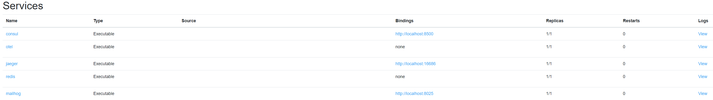
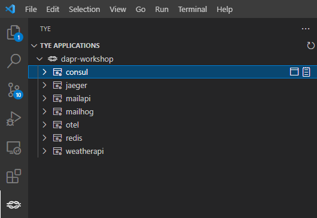
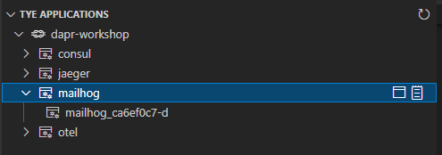

# Assignment 1

## Goal
In this assignment we will create the solution outline. We will create a Tye YAML file with a set of defined services to start.

After this assignment we know

- how to define and run 'executables' from within Project Tye

The following services will be setup:

- [Consul](https://www.consul.io/docs/intro) - Service Mesh solution - used by DAPR for Service Discovery and performs health checks
- [OpenTelemetry Collector](https://opentelemetry.io/docs/collector/) - vendor-agnostic way to receive, process and export telemetry data
- [Jaeger](https://www.jaegertracing.io/) - Open source, end-to-end distributed tracing platform including UI
- [Mailhog](https://github.com/mailhog/MailHog) -  SMTP development server including UI

## Steps

### Prerequisite

- Open VS Code
- Open the assignment-1 VS Code workspace from the workspaces folder using "File > Open Workspace from File"

### Step 1. Add services to Tye and run them

Start the following executables from the tools directory by defining them as a service in the tye.yaml file.

| name | executable | arguments | http port |
|---|---|----|---|
|consul|consul.exe|```agent --dev```|8500|
|otel|otelcol-contrib.exe|```--config ../src/otel.yaml```|n/a|
|jaeger|jaeger-all-in-one.exe|```--config-file ../src/jaeger.yaml --log-level debug```|16686|
|mailhog|MailHog_windows_amd64.exe|n/a|8025|

Make sure that:

- the executable path is: ```../../../tools/<executable>.exe```
- the working directory of each service is: ```../../../tools/```
- replicas is set to: ```1```

An example 'executable' Tye service:

(replace the placeholders with the values from the table above)

```yaml
services:
- name: <name>
  executable: ../../../tools/<executable>.exe 
  args: <arguments>
  replicas: 1 
  workingDirectory: ../../../tools/
  bindings: 
  - port: <http port>
    protocol: http
```

Now run by Tye pressing F5 or choose 'Launch Tye' on the 'Run an Debug' window (Ctrl-Shift-D)

> You will probably see the following message: ```Failed to collect diagnistics``` when running Tye. This message can be ignored.

### Step 2. Inspect the Tye dashboard

Open your browser and go to the Tye dashboard: http://127.0.0.1:8000/

You will see:


### Step 3. Inspect the Consul, Jaeger and MailHog dashboards

Click on each "Bindings" link and check:

- Consul dashboard : http://localhost:8500/
- Jaeger dashboard  : http://localhost:16686/
- MailHog dashboard : http://localhost:8025/

### Step 4. Inspect the logs

Click on each "Logs" link and check the  output of each service:

- Consul logs : http://127.0.0.1:8000/logs/consul
- Jaeger logs : http://127.0.0.1:8000/logs/jaeger
- MailHog logs : http://127.0.0.1:8000/logs/mailhog

### Step 5. Use the VS Code Tye extension

The services running in Tye and the links to http bindings and logs can also be accessed using the VS Code Tye Extension:



When hovering over the dapr-workshop Tye application can click on the 'meter cog' to access the Tye dashboard. When hovering over a service you will see two icons with a link appear: one the according dashboard and one the according logs.



Congrats! You now have a working base solution outline for running distributed applications!
