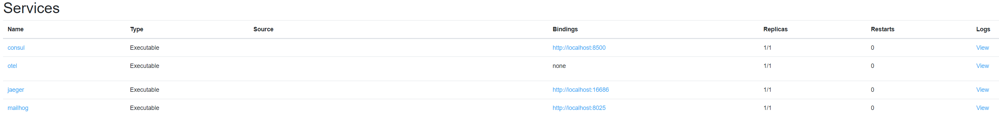

# Assignment 1
## Goal
The purpose of this assignment  is to setup a working set of services which are prerequisites in order to be able to create microservices. 

The following services will be setup:

- [Consul](https://www.consul.io/docs/intro) - Service Mesh solution - used by DAPR for Service Discovery and performs health checks
- [OpenTelemetry Collector](https://opentelemetry.io/docs/collector/) - vendor-agnostic way to receive, process and export telemetry data
- [Jaeger](https://www.jaegertracing.io/) - Open source, end-to-end distributed tracing platform including UI
- [Mailhog](https://github.com/mailhog/MailHog) -  SMTP development server including UI

## Steps

### Prerequisite

Open the assignment-1 VS Code workspace in the workspaces folder

### Step 1.
Start the following executalabes from the tools directory by defining them as a service in the tye.yaml file.

| name | arguments | http port |
|---|----|---|
|consul|```agent --dev```|8500|
|otel|```--config ../src/otel.yaml```|n/a|
|jaeger|```--config-file ../src/jaeger.yaml --log-level debug```|16686|
|redis|n/a|n/a|
|mailhog|n/a|8025|

Make sure that:
- the executable path is: ```../../../tools/example.exe```
- the working directory of each service is: ```../../../tools/```
- replicas is set to: ```1```

An example 'executable' Tye service:

```yaml
services:
- name: example
  executable: ../../../tools/<example>.exe 
  args: <put-your-arguments-here>
  replicas: 1 
  workingDirectory: ../../../tools/
  bindings: 
  - port: <your-http-port>
    protocol: http
```

Now run Tye pressing F5 or choose 'Launch Tye' on the 'Run an Debug' window (Ctrl-Shift-D)

### Step 2.
Open your browser and go to the Tye dashboard: http://127.0.0.1:8000/

You wil see:


### Step 3.
Click on each "Bindings" link and check:
- Consul dashboard : http://localhost:8500/
- Jaeger dashboard  : http://localhost:16686/
- MailHog dashboard : http://localhost:8025/

### Step 4.
Click on each "Logs" link and check the  output of each service:
- Consul logs : http://127.0.0.1:8000/logs/consul
- Jaeger logs : http://127.0.0.1:8000/logs/jaeger
- MailHog logs : http://127.0.0.1:8000/logs/mailhog

### Step 5.
The services running in Tye and the links to http bindings and logs can also be accessed using the VS Code Tye Extension:


When hovering over the dapr-workshop Tye application can click on the 'meter cog' to access the Tye dashboard. When hovering over a service you will see two icons with a link appear: one the according dashboard and one the according logs.

Congrats! You now have a working base solution outline for running distributed applications!