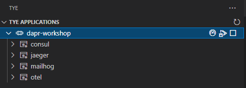

# Assignment 1

the purpose of assignment 1 is to setup a working set of services which are prerequisites in order to be able to create microservices. 

## Services
The following services should be setup:

- [Consul](#consul) - Cervice Mesh Solution
- [opentelemetry collector](#open-telemetry-collector) - vendor-agnostic way to receive, process and export telemetry data
- [Jaeger](#jaeger) - Open source, end-to-end distributed tracing
- [Mailhog](#mailhog)

### Consul
[Consul](https://www.consul.io/docs/intro) is a service mesh solution

### OpenTelemetry collector
THe [Opentelemetry collector](https://opentelemetry.io/docs/collector/) receives, processes and exports traces, logs and metrics.

### Jaeger
[Jaeger](https://www.jaegertracing.io/) is used to view the distributed traces

### Mailhog
[Mailhog](https://github.com/mailhog/MailHog) is a development SMTP mail server including a UI

### Steps

#### 1.
Start the following executalabes from the tools directory by defining them as a service in the tye.yaml file.

| name | arguments | http port |
|---|----|---|
|consul|agent --dev|8500|
|otel|--config ../src/otel.yaml|n/a|
|jaeger|--config-file ../src/jaeger.yaml --log-level debug|16686|
|redis|n/a|n/a|
|mailhog|n/a|8025|

Make sure that:
- the executable path is: ../../../tools/example.exe
- the working directory of each service is: ../../../tools/
- replicas is set to: 1

#### 2.
When done, open your browser and go to the Tye dashboard: http://127.0.0.1:8000/

You wil see:

#### 3.
Click on each "Bindings" link and check:
- Consul dashboard : http://localhost:8500/
- Jaeger dashboard  : http://localhost:16686/
- MailHog dashboard : http://localhost:8025/

#### 4.
Click on each "Logs" link and check the  output of each service:
- Consul logs : http://127.0.0.1:8000/logs/consul
- Jaeger logs : http://127.0.0.1:8000/logs/jaeger
- MailHog logs : http://127.0.0.1:8000/logs/mailhog

#### 5.
The services running in Tye and the links to http bindings and logs can also be accessed using the VS Code Tye Extension:

When hovering over the dapr-workshop Tye application can click on the 'meter cog' to access the Tye dashboard. When hovering over a service you will see two icons with a link appear: one the according dashboard and one the according logs.