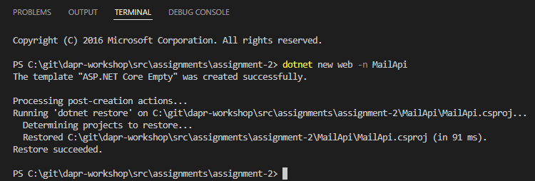

# Assignment 2

## Goal

The purpose of this assignment is to create a Mail API with a health and cron job endpoint.

## Steps

### Prerequisite

Open the assignment-2 VS Code workspace in the workspaces folder

### Step 1.

Lets open a terminal. 
Right click in the 'src' folder and choose 'Open in Integrated Terminal'


A new terminal window (propably Powershell) will be opened with 'assignment-2' as the working directory.


### Step 2. Create new ASP.NET Project

Create a new empty ASP.NET Project with the name 'MailApi' using this command from the terminal:

```dotnet new web -n MailApi```

The project will be scaffolded:



Now add the package reference using this command from the terminal:

```dotnet add MailApi package Swashbuckle.AspNetCore```


Open the MailApi/Properties/launchSettings.json file and change the MailApi profile so the "applicationUrl" ports are set to 7138 (https) and 5200 (http):

```json
"profiles": {
    "MailApi": {
      "commandName": "Project",
      "dotnetRunMessages": true,
      "launchBrowser": true,
      "applicationUrl": "https://localhost:7138;http://localhost:5200",
      "environmentVariables": {
        "ASPNETCORE_ENVIRONMENT": "Development"
      }
    }
```

### Step 3. Add Swagger and Health endpoint

Open the Program.cs file from the MailApi folder.

Add the following 3 services to the builder before building the builder.
```c#
var builder = WebApplication.CreateBuilder(args);
// Add services to the container.
// Learn more about configuring Swagger/OpenAPI at https://aka.ms/aspnetcore/swashbuckle
builder.Services.AddEndpointsApiExplorer();
builder.Services.AddSwaggerGen();
builder.Services.AddHealthChecks();
var app = builder.Build();
```
Remove the ``` app.MapGet("/", () => "Hello World!"); ``` statement.

After the ```app.Build``` command add this if-statement:
```c#
// Configure the HTTP request pipeline.
if (app.Environment.IsDevelopment())
{
    app.UseSwagger();
    app.UseSwaggerUI();
}
app.MapHealthChecks("/health");
```


### Step 4. Create the POST cronjob endpoint

```c#
app.MapPost("/cronmail", async () =>
{
    return "Working!";
})
.WithName("cronmail");
```

### Step 5. Run the MailApi

Run the MailApi using this command from the terminal:

```dotnet run --project MailApi```

Check that :
- the Health endpoint is working : http://localhost:5200/health
- the Swagger endpoint is working: http://localhost:5200/swagger/index.html

In the Swagger UI,
1. click on POST /cronmail
2. click the 'Try it out' button
3. click on 'Execute'
4. check that the response code is 200 and the body contains the string 'Working!'


