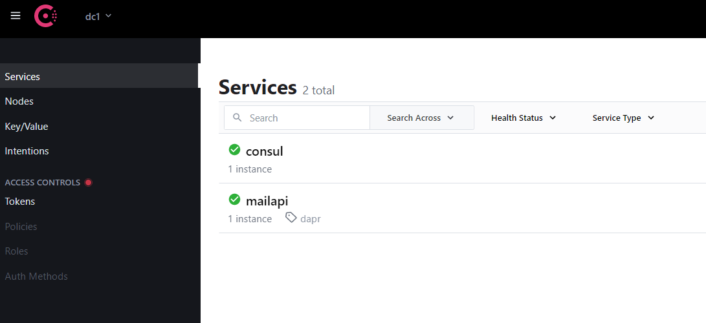
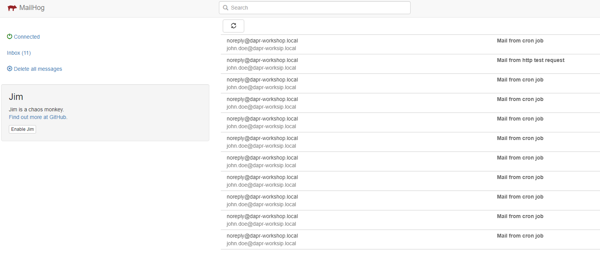

# Assignment 3

## Goal

In this assignment we will 'DAPRize' the Mail API and run it from Tye.

After this assignment we know

- how to create/add DAPR components
  - create input and output bindings
  - create secret store with a secrets file
- how to run this Api from Tye
- how to trigger the Web Api operation using the DAPR input binding
- how to call the DAPR output binding to send an email
- how we can test HTTP endpoints using the RestClient VS Code extension

## Steps

### Prerequisite

- Open VS Code
- Open the assignment-3 VS Code workspace from the workspaces folder using "File > Open Workspace from File"

### Step 1. Add DAPR components
Create a 'dapr-components' folder within the 'src' folder of this workspace.

Add the following yaml files to this new directory:
-  cron input binding file named 'bindings.cron.email.yaml'
```yaml
apiVersion: dapr.io/v1alpha1
kind: Component
metadata:
  name: cronmail
  namespace: default
spec:
  type: bindings.cron
  version: v1
  metadata:
  - name: schedule
    value: "@every 1m" # valid cron schedule
```
- smtp output binding file named 'bindings.smtp.mailhog.yaml'
```yaml
apiVersion: dapr.io/v1alpha1
kind: Component
metadata:
  name: dapr-smtp
  namespace: default
spec:
  type: bindings.smtp
  version: v1
  metadata:
  - name: host
    value: localhost
  - name: port
    value: 1025
  - name: user
    secretKeyRef:
      name: smtp.user
      key: smtp.user
  - name: password
    secretKeyRef:
      name: smtp.password
      key: smtp.password
  - name: skipTLSVerify
    value: true
auth:
  secretStore: dapr-secrets
```

- secret store compponent file named 'secretstores.local.file.yaml'
```yaml
apiVersion: dapr.io/v1alpha1
kind: Component
metadata:
  name: dapr-secrets
  namespace: default
spec:
  type: secretstores.local.file
  version: v1
  metadata:
  - name: secretsFile
    value: ../../../secrets.json
  - name: nestedSeparator
    value: "."
  - name: multiValued
    value: "false"
```

### Step 2. Add Mail Api service to Tye and run it by using the bootstrap powershell script

Open the Tye.yaml file. Add the MailApi service to a new 'APIs' section underneath the 'Tools' section:

```yaml
#APIs
- name: mailapi
  executable: powershell.exe 
  args: -file "../../../Tools/bootstrap.ps1" ../src/assignments/assignment-3/MailApi mailapi 5200 3500 60400 ../src/dapr-configuration.yaml ../src/assignments/assignment-3/dapr-components default dotnet
  workingDirectory: .
  replicas: 1
  bindings:
  - protocol: http
    port: 5200
```

### Step 3. Add the DAPR SDK package reference

Right click in the 'src' folder and choose 'Open in Integrated Terminal'

A new terminal window (propably Powershell) will be opened with 'assignment-3' as the working directory.

Now add the package reference using this command from the terminal:

```dotnet add MailApi package Dapr.AspNetCore```

### Step 4. Change cron mail endpoint so it sends email using DAPR output binding

Open the Program.cs
Add the following using statement:
```c#
using Dapr.Client;
```

Change the cronmail endpoint so it sends an email using the Dapr output binding:
```c#
app.MapPost("/cronmail", async () =>
{
    var daprClient = new DaprClientBuilder().Build();
    var metadata = new Dictionary<string, string>
    {
        ["emailFrom"] = "noreply@dapr-workshop.local",
        ["emailTo"] = "john.doe@dapr-worksip.local",
        ["subject"] = $"Mail from cron job"
    };

    string body = $"Wow, it's Working!";

    await daprClient.InvokeBindingAsync("dapr-smtp", "create", body, metadata);
})
.WithName("cronmail");
```

### Step 5. Run the Tye solution
Press F5 :)

### Step 6. Test endpoints using REST Client extension
Create a new 'test.http' file in your 'src' folder

Add two http tests to this file:
1. test cronmail using Dapr service invocation
```http
### test cronmail service invocation
POST http://localhost:3500/v1.0/invoke/mailapi/method/cronmail HTTP/1.1
```
2. test Dapr smtp output binding
```http
### test smtp output binding
POST http://localhost:3500/v1.0/bindings/dapr-smtp HTTP/1.1
Content-Type: application/json

{
  "operation": "create",
  "metadata": {
    "emailFrom": "noreply@dapr-workshop.local",
    "emailTo": "john.doe@dapr-worksip.local",
    "emailCC": "cc1@example.net; cc2@example.net",
    "subject": "Mail from http test request"
  },
  "data" : "test"

}
```

Within VS Code you will see a 'Send Request' button rendered above each test:


Execute both tests and check the results.

### Step 7. Check the dashboards
Every minute Dapr will execute the cron job. It invokes the input binding which executes our cronmail endpoint. This endpoint creates an email and sends it using the Dapr SMTP outpub binding to MailHog.

Check the dashboard of:
- Consul on http://127.0.0.1:8500/ 

You can see that consul and mailapi are correctly running



- MailApi logs in the Tye Dashboard on http://127.0.0.1:8000/logs/mailapi

You can see that Dapr and mailapi are running and that the cron job is invoking the cronmail operation (after 1 minute, and then each minute).
You also see that the cronmail operation is invoking the Dapr SMTP output binding.


- Jaeger on http://127.0.0.1:16686/


In Jaeger UI you can the cronmail endpoint call by the Dapr cron job. You also see the call to the Dapr SMTP output binding by the cronmail endpoint.


- Mailhog on http://localhost:8025/

You can see that emails are received from the cron job AND the REST client extension
 
