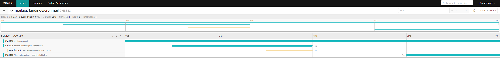
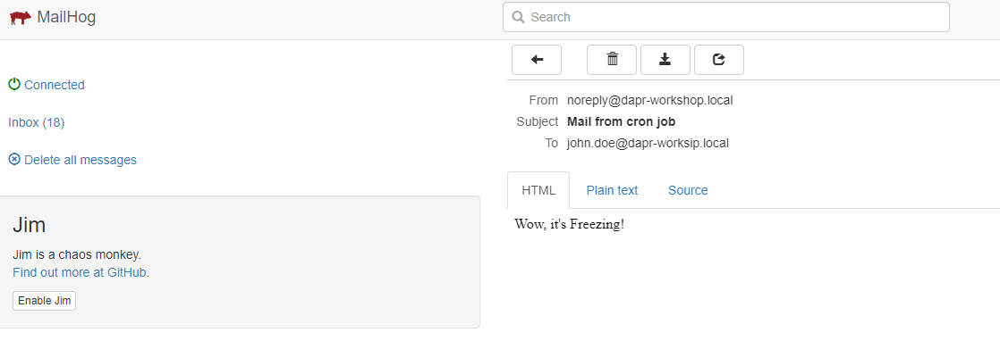

# Assignment 6

## Goal

In this assignment we will use the Dapr Service Invocation building block to call a the WeatherApi service from the MailApi service.

After this assignment we know

- how to add the weatherforecast return type record 
- how we can call the weatherapi from the mailapi using the Dapr SDK and the service invocation building block
- how to get a forecast from the result and put it in the mail to be sent

## Steps

### Prerequisite

- Open VS Code
- Open the assignment-6 VS Code workspace from the workspaces folder using "File > Open Workspace from File"

### Step 1. Add the weather forecast result type

In the Program.cs class from the MailApi, add the following record underneath the last line of code:

```c#
internal record WeatherForecast(DateTime Date, int TemperatureC, string? Summary)
{
    public int TemperatureF => 32 + (int)(TemperatureC / 0.5556);
}
```


### Step 2. Call the WeatherApi from the MailApi cronmail endpoint

Within the cronmail operation use the Dapr client to invoke the "weatherforecast" method on the "weatherapi" app using a GET.

Add this line of code underneath the metaData initialization:
```c#
var result = await daprClient.InvokeMethodAsync<IEnumerable<WeatherForecast>>(HttpMethod.Get, "weatherapi", "weatherforecast");
```

### Step 3. Change the body of the email
Now let's change the body of the email and use the summary of the first returned weatherforecast:

```c#
string body = $"Wow, it's {result.FirstOrDefault().Summary}!";
```

The Program.cs class from the MailApi now looks like:
```c#
using Dapr.Client;

var builder = WebApplication.CreateBuilder(args);

// Add services to the container.

// Learn more about configuring Swagger/OpenAPI at https://aka.ms/aspnetcore/swashbuckle
builder.Services.AddEndpointsApiExplorer();
builder.Services.AddSwaggerGen();
builder.Services.AddHealthChecks();

var app = builder.Build();

// Configure the HTTP request pipeline.
if (app.Environment.IsDevelopment())
{
    app.UseSwagger();
    app.UseSwaggerUI();
}
app.MapHealthChecks("/health");

app.MapPost("/cronmail", async () =>
{
    var daprClient = new DaprClientBuilder().Build();
    var metadata = new Dictionary<string, string>
    {
        ["emailFrom"] = "noreply@dapr-workshop.local",
        ["emailTo"] = "john.doe@dapr-worksip.local",
        ["subject"] = $"Mail from cron job"
    };  

    var result = await daprClient.InvokeMethodAsync<IEnumerable<WeatherForecast>>(HttpMethod.Get, "weatherapi", "weatherforecast");

    string body = $"Wow, it's {result.FirstOrDefault().Summary}!";

    await daprClient.InvokeBindingAsync("dapr-smtp", "create", body, metadata);
})
.WithName("cronmail");

app.Run();

internal record WeatherForecast(DateTime Date, int TemperatureC, string? Summary)
{
    public int TemperatureF => 32 + (int)(TemperatureC / 0.5556);
}
```

### Step 4. Run the Tye solution
Press F5 :)

### Step 5. Check the dashboards
 
 In the trace you can see that the mailapi is now calling the weatherapi!



And the mails are being sent and received!



You have done it!

